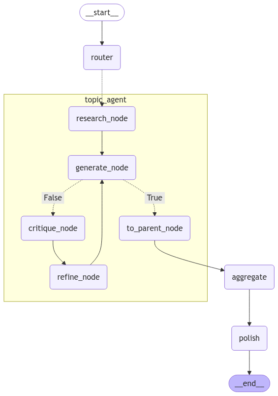

# Multi-Agent Company Researcher

## Overview
This project is a multi-agent web application that executes comprehensive company research based on user-specified criteria. The agents collaborate to research, synthesize, and aggregate relevant information on financial health, market position, recent news, and more to produce a final research report. The app was built using LangGraph and Tavily.


## Main Points

### 1. **Multi-Agent Collaboration**
- A parent CoordinatorAgent initializes and orchestrates ad-hoc, topic-focused agents based on user input.
- Each topic agent undertakes a specific research topic/section in the final report.
- The CoordinatorAgent aggregates and polishes the outputs of the topic agents into an HTML-formatted final report.



(**Note:** the topic_agent subgraph is executed in parallel for each user-requested topic)

### 2. **Asynchronous Workflow & Streaming**
- Checkpoints are stored in MongoDB using `AsyncMongoClient` and `AsyncMongoDBSaver`, ensuring state persistence.
- Topic agents work in parallel to speed up research.
- Events are streamed as they happen to the client for smoother UX.

### 3. **Scalability and Flexibility**
- Configurable to support more topics.


## Setting Up MongoDB Atlas for the Application

### **Step 1: Create a MongoDB Atlas Cluster**
1. Go to [MongoDB Atlas](https://www.mongodb.com/cloud/atlas).
2. Sign up or log in to your account.
3. Click **Create a Cluster**:
   - Choose the **Shared Cluster (Free)** for development/testing purposes.
   - Select your preferred cloud provider (AWS, Azure, GCP) and region.


### **Step 2: Configure the Cluster**
1. Once the cluster is created, click **Browse Collections** and set up a new database:
   - **Database Name:** `checkpoints` (or your preferred name).
   - **Checkpoints Collection Name:** `state_snapshots`
   - **Checkpoint Writes Collection Name:** `state_snapshots_writes`

2. Go to **Network Access**:
   - Click **Add IP Address**.
   - Add your IP address (or `0.0.0.0/0` for testing).

3. Go to **Database Access** (optional):
   - Click **Add New Database User**.
   - Set the username and password (e.g., `app_user` / `secure_password`).
   - Select **Built-In Roles**: Use **Read and Write to Any Database**.


### **Step 3: Get the Connection String**
1. Go to **Clusters** and click **Connect**.
2. Choose **Connect your application**.
3. Copy the connection string (e.g., `mongodb+srv://<username>:<password>@cluster0.mongodb.net/my_database?retryWrites=true&w=majority`).
4. Add the connection string to your `.env` file:
   ```
   MONGO_URI=<uri>
   ```
   

### **Important Notes**
- Replace `<username>` and `<password>` in the connection string with the database user credentials you created.


## Setup Instructions: Locally

### 1. **Clone the Repository**
```bash
git clone https://github.com/tomcohen13/MultiAgentResearchApp.git
cd MultiAgentResearchApp
```

### 2. **Install Dependencies**
Ensure you have Python 3.10 or later.
```bash
pip install -r requirements.txt
```

### 3. **Environment Variables**
Create a `.env` file in the project root and add the following:
```
TAVILY_API_KEY=<your_tavily_api_key>
OPENAI_API_KEY=<your_openai_api_key>
MONGO_URI=mongodb://localhost:27017
```

### 4. **Run the Application Locally**
Start the FastAPI app:
```bash
python3 main.py
```
or (if you're making edits)
```bash
uvicorn main:app --reload
```
Access the app at `http://127.0.0.1:8000`.


## Setup Instructions: Deploying to AWS BeanStalk

### 1. Create the Application
1. Navigate to the AWS Console > Elastic BeanStalk
2. Select a region depending on your target location, e.g., `us-east-1`.
3. Click on the side bar (stacked-lines icon) > Applications > Create Application
4. Name the application (I used `ai-company-researcher`), add a description (optional), and hit **Create**.

### 2. Configure Application Environment
1. Once the application was created, click **Create new environment**
2. **Environment tier**: select "Web server environment"
3. **Application information**: should be auto-filled
4. **Environment information**: select an environment name and a Domain
5. **Platform**:  
   - Platform type: Select "Managed platform" 
   - Platform: Select "Python"
   - Platform branch: I used Python 3.11 to match my local environment
   - Platform version: 4.3.2 (Recommended)
6. Application code: for now select the "Sample application" and later we'll integrate a CICD pipeline with GitHub.
7. Presets: Since the instructions state that the application should support multiple instances, I opted for "High availability (spot and on-demand instances)" to balance availability and cost.
8. Click "Next"

### 3. Configure service access
1. Service access: unless you have one that matches the desired permissions, create a new service role.
2. EC2 Pair (if you don’t have one yet): 
   1. Go to the EC2 Console
   3. Go to **Key Pairs**
   4. Click **Create key pair**
   5. Provide a name (e.g., my-ec2-key).
   6. Choose pem as the file format (for Linux/Mac) or ppk (for Windows with PuTTY).
   7. Download the Private Key:
      - AWS will provide the private key (.pem or .ppk) as a download.
      - Important: Keep this file secure. You won’t be able to download it again.
   8. Return to AWS BeanStalk
   9. Hit the refresh below the **EC2 key pair** selection bar
   10. Select your newly created key pair
3. EC2 instance profile (following AWS recommended guidelines):
   1. Create an IAM Role:
      - Navigate to the IAM Console > Roles > Create Role.
      - Select AWS Service and choose EC2.
      - Attach the recommended policies: AWSElasticBeanstalkWebTier, AWSElasticBeanstalkWorkerTier, AWSElasticBeanstalkMulticontainerDocker
   2. Name the role (e.g., beanstalk-ec2-profile)
   3. Create role
   4. Back to Elastic Beanstalk setup, refresh the available profiles and select the newly created one.
   5. Next!


### 4. Set up networking (skipped):
   - I skipped on this one given the public nature of the application


### 5. Configure instance traffic and scaling:
   1. Security groups: check `default`
   2. Capacity
      - Make sure the Environment type is set to "Load balanced".
      - **Instances**: I set Min to 2 and Max to 5 to accommodate (small) scaling while ensuring a bit of redundancy always.
      - **Fleet composition**: I chose On-Demand for production-like availability. This choice avoids potential interruptions of Spot Instances and scales well.
      - **Architecture** I set it to the default x86_64
      - **Instance types**: 
         1. Primary - t3.small: Balancing cost and resources.
         2. Fallback 1 - t3.micro: For low-cost fallback during capacity issues.
         (though i don't think it matters in my settings)
   3. Next!


### 6. Configure updates, monitoring, and logging:
   1. I've added on my end Log Streaming using CloudWatch, but it's optional
   2. Email notifications: specify your email to get updates if anything crashes.


### 7. Review and Submit!
   - it might take a few minutes for the application environment to launch
   - Take a break or sth; that was exhausting 🥵

### 8. Configure CICD Pipeline with GitHub
   1. Navigate to the CodePipeline console
   2. Select Build custom pipeline and continue
   3. Pipeline settings:
      - Name the pipeline
      - Execution mode: I selected "Superseded" for this project because it ensures that only the latest version of the application is deployed. For a single-developer, low-traffic project, this is the most resource-friendly option. In a production environment with more contributors or critical testing requirements, I'd consider Queued or Parallel modes.
   4. Add source
      - Connect to GitHub
      - Choose the relevant repository and branch (in my case MultiAgentResearchApp and 'develop')
   5. Skip build stage given the project
   6. Skip test stage given the project
   7. Deploy to EB
      - Choose Deploy provider AWS Elastic Beanstalk
      - Choose the region of your environment
      - select the application and its corresponding environment
   8. Deploy the pipeline!
 

## Usage


1. Navigate to the web interface.
2. Enter a **company name** and select desired **research criteria** from the topics below the search bar.
3. Hit **Search** to trigger the workflow.
4. Watch as results stream in real-time on the page.


## **Project Structure:**
```
app/
│
├── main.py   # Entry point for FastAPI, app logic
├── requirements.txt # Python dependencies
├── Procfile         # Specifies how to run the app on EB
├── agents/   # main backend logic
│   └── agents.py   # Core agents logic
│   └── constants.py   # Application-wide constants
│   └── llm.py   # llm-related functions
│   └── prompts.py   # agent prompts
│   └── states.py   # agent states
├── static/   # main backend logic
│   └── header-fade.js   # fade-in effect
│   └── script.js   # Client-side logic for streaming and UI updates
│   └── style.css   # main styling file
├── templates/   # HTML files
│   └── index.html   # Website HTML
└── README.md        # Documentation of the project
```


## Monitoring and Scaling
- Using AWS CloudWatch to monitor logs
- Use Beanstalk monitoring to keep track of CPU utilization
- Adjust auto-scaling settings in the Elastic Beanstalk console as needed.


## Future Enhancements
- Improved error handling for robust performance.
- Input validation.
- Architecture improvements.
- Enhanced visualizations of results.
- Caching frequent queries
- Human-in-the-loop or retrospective feedback 👍/👎

## Thoughts & Disclaimer
- I initially hard-coded the architecture with the selected topics, adding designated subgraphs per user-specified topic. Although the graph as a whole was not too overwhelming for 4 topics, it didn't feel very elegant for a larger-scale application, so I resorted to having one TopicAgent architecture that gets replicated and run in parallel, ad-hoc, given the user-specified topics. This is similar to the GPT-Researcher implementation. The downside of that is that the nodes are named generically. Curious to hear your thoughts!
